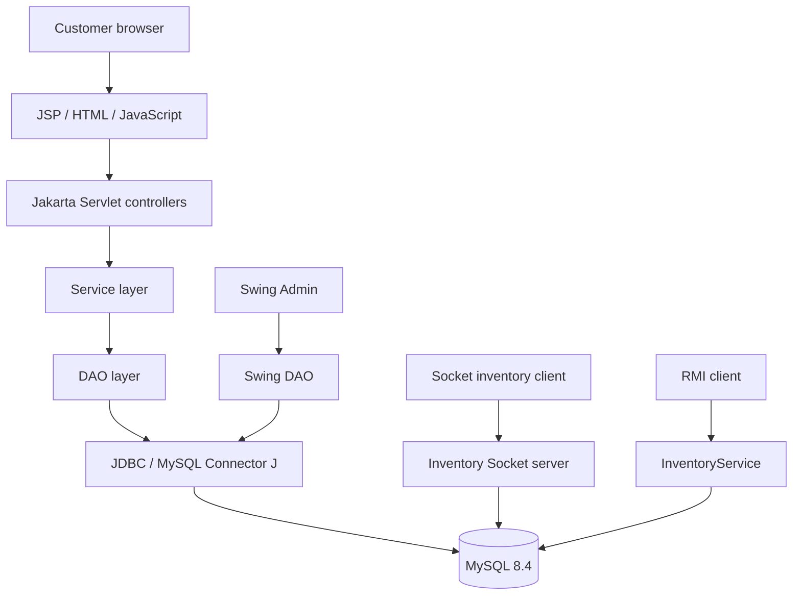
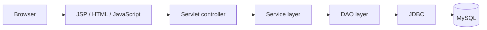

# ShopSphere architecture

## Overall application

```mermaid
flowchart TB
    Browser[Customer browser] --> Web[JSP / HTML / JavaScript]
    Web --> Servlet[Jakarta Servlet controllers]
    Servlet --> Service[Service layer]
    Service --> DAO[DAO layer]
    DAO --> JDBC[JDBC / MySQL Connector J]
    JDBC --> DB[(MySQL 8.4)]
    Swing[Swing Admin] --> SwingDAO[Swing DAO]
    SwingDAO --> JDBC
    SocketClient[Socket inventory client] --> SocketServer[Inventory Socket server]
    SocketServer --> DB
    RMIClient[RMI client] --> RMIService[InventoryService]
    RMIService --> DB
```

## Web request tiers

```mermaid
flowchart LR
    Browser --> Presentation[JSP / HTML / JavaScript]
    Presentation --> Controller[Servlet controller]
    Controller --> Business[Service layer]
    Business --> Data[DAO layer]
    Data --> JDBC[JDBC]
    JDBC --> MySQL[(MySQL)]
```

The customer web app keeps presentation, request handling, business rules, and database access in separate layers.
