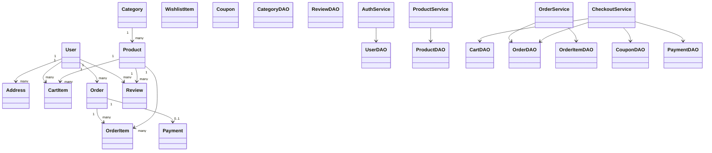

# ShopSphere class diagram

```mermaid
classDiagram
    class User
    class Address
    class Category
    class Product
    class CartItem
    class WishlistItem
    class Order
    class OrderItem
    class Payment
    class Review
    class Coupon
    class UserDAO
    class ProductDAO
    class CategoryDAO
    class CartDAO
    class OrderDAO
    class OrderItemDAO
    class ReviewDAO
    class CouponDAO
    class AuthService
    class ProductService
    class OrderService
    class CheckoutService
    User "1" --> "many" Address
    User "1" --> "many" CartItem
    Product "1" --> "many" CartItem
    Category "1" --> "many" Product
    User "1" --> "many" Order
    Order "1" --> "many" OrderItem
    Product "1" --> "many" OrderItem
    Order "1" --> "0..1" Payment
    User "1" --> "many" Review
    Product "1" --> "many" Review
    AuthService --> UserDAO
    ProductService --> ProductDAO
    OrderService --> OrderDAO
    OrderService --> OrderItemDAO
    CheckoutService --> CartDAO
    CheckoutService --> CouponDAO
    CheckoutService --> OrderDAO
    CheckoutService --> PaymentDAO
```

The web model and DAO source live under `web/src/main/java/com/shopsphere/`.
