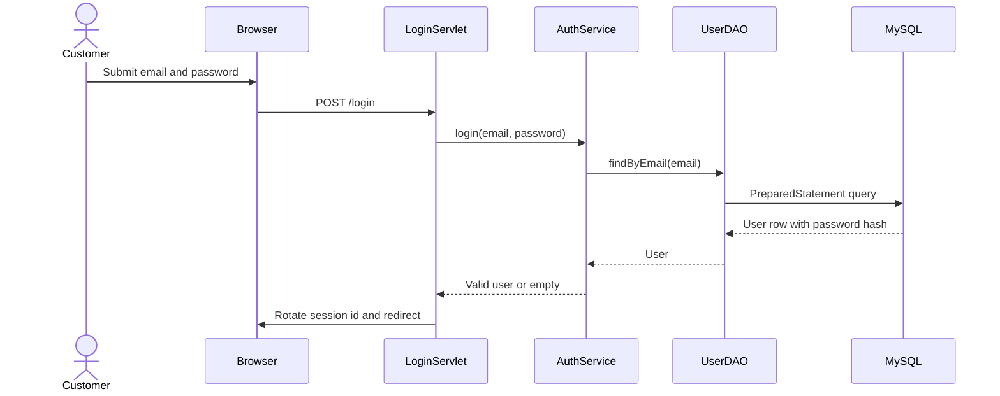
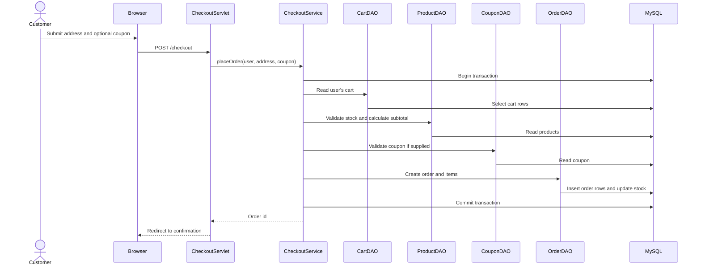

# ShopSphere sequence diagrams

## Login

```mermaid
sequenceDiagram
    actor Customer
    participant Browser
    participant LoginServlet
    participant AuthService
    participant UserDAO
    participant MySQL
    Customer->>Browser: Submit email and password
    Browser->>LoginServlet: POST /login
    LoginServlet->>AuthService: login(email, password)
    AuthService->>UserDAO: findByEmail(email)
    UserDAO->>MySQL: PreparedStatement query
    MySQL-->>UserDAO: User row with password hash
    UserDAO-->>AuthService: User
    AuthService-->>LoginServlet: Valid user or empty
    LoginServlet->>Browser: Rotate session id and redirect
```

## Order checkout

```mermaid
sequenceDiagram
    actor Customer
    participant Browser
    participant CheckoutServlet
    participant CheckoutService
    participant CartDAO
    participant ProductDAO
    participant CouponDAO
    participant OrderDAO
    participant MySQL
    Customer->>Browser: Submit address and optional coupon
    Browser->>CheckoutServlet: POST /checkout
    CheckoutServlet->>CheckoutService: placeOrder(user, address, coupon)
    CheckoutService->>MySQL: Begin transaction
    CheckoutService->>CartDAO: Read user's cart
    CartDAO->>MySQL: Select cart rows
    CheckoutService->>ProductDAO: Validate stock and calculate subtotal
    ProductDAO->>MySQL: Read products
    CheckoutService->>CouponDAO: Validate coupon if supplied
    CouponDAO->>MySQL: Read coupon
    CheckoutService->>OrderDAO: Create order and items
    OrderDAO->>MySQL: Insert order rows and update stock
    CheckoutService->>MySQL: Commit transaction
    CheckoutService-->>CheckoutServlet: Order id
    CheckoutServlet-->>Browser: Redirect to confirmation
```
