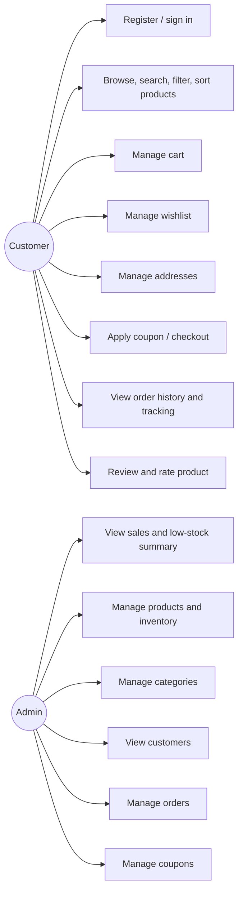

# ShopSphere use cases

```mermaid
flowchart LR
    Customer((Customer)) --> Register[Register / sign in]
    Customer --> Browse[Browse, search, filter, sort products]
    Customer --> Cart[Manage cart]
    Customer --> Wishlist[Manage wishlist]
    Customer --> Address[Manage addresses]
    Customer --> Checkout[Apply coupon / checkout]
    Customer --> Orders[View order history and tracking]
    Customer --> Review[Review and rate product]
    Admin((Admin)) --> Dashboard[View sales and low-stock summary]
    Admin --> Product[Manage products and inventory]
    Admin --> Category[Manage categories]
    Admin --> CustomerList[View customers]
    Admin --> OrderMgmt[Manage orders]
    Admin --> Coupon[Manage coupons]
```

Customer pages require an authenticated session where appropriate. The admin area requires the `ADMIN` role.
